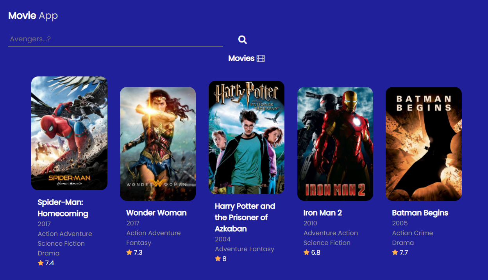
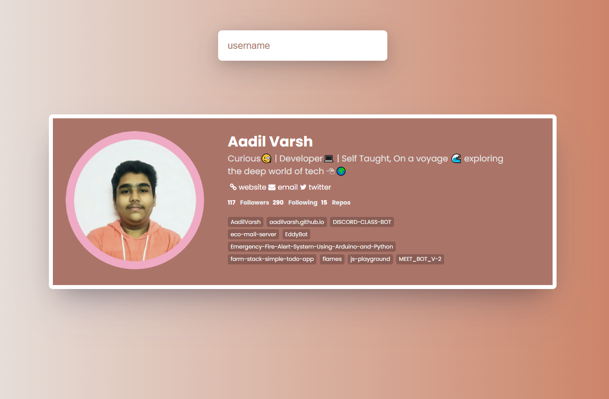

# **js-playground**
## **My JS practice PROJECT playground 🚀🌟**

 

* ## **[CountDown Timer](/CountdownTimer)**
    * 

        
Preview 👇

        

        

* ## **[QuizApp](/QuizApp)**
    * 

        
Preview 👇

        

        

* ## **[RecipeApp](/RecipeApp)**
    * 

        
Preview 👇

        

        

* ## **[NotesApp](/NotesApp)**
    * 

        
Preview 👇

        

        

* ## **[TodoApp](/TodoApp)**
    * 

        
Preview 👇

        

        

* ## **[MovieApp](/MovieApp)**
    * 

        
Preview 👇

        

        

* ## **[GithubProfilesApp](/GithubProfiles)**
    * 

        
Preview 👇

        

        

